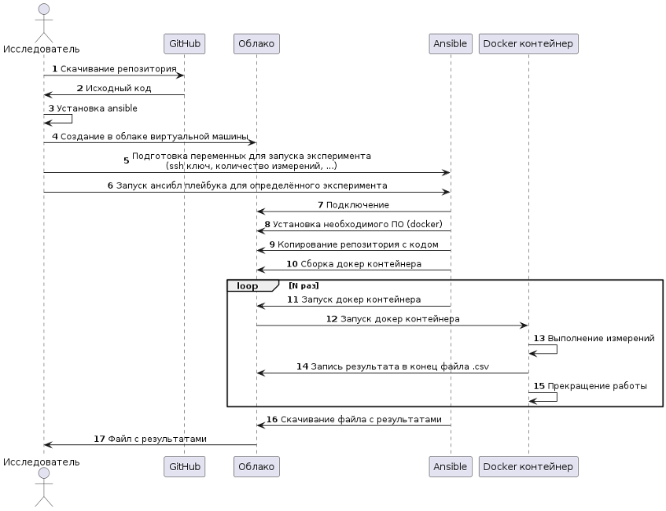

# Руководство по запуску проекта

В этом документе описаны инструкции по запуску проекта сравнения производительности сред выполнения JavaScript (Node.js, Deno, Bun) как локально, так и на удаленных серверах.

## Предварительные требования

### Локальный запуск

- Docker (версия 20.10.0 или выше)
- Bash-совместимый терминал
- Git

### Удаленный запуск

- Ansible (версия 2.9 или выше)
- Python 3.6+ с библиотекой requests
- SSH-доступ к удаленным серверам
- Учетные данные с правами sudo на удаленных серверах

## Локальный запуск

### Клонирование репозитория

```bash
git clone <url-репозитория>
cd environments-comparison
```

### Запуск бенчмарков для отдельной среды выполнения

#### Node.js

```bash
cd node
npm run build         # Создание Docker-образа
npm run run           # Запуск бенчмарка один раз
npm run run:multiple:times  # Запуск бенчмарка несколько раз
npm run build:and:run # Создание образа и запуск бенчмарка
```

#### Deno

```bash
cd deno
deno task build               # Создание Docker-образа
deno task run                 # Запуск бенчмарка один раз
deno task run:multiple:times  # Запуск бенчмарка несколько раз
deno task build:and:run       # Создание образа и запуск бенчмарка
```

#### Bun

```bash
cd bun
npm run build               # Создание Docker-образа
npm run run                 # Запуск бенчмарка один раз
npm run run:multiple:times  # Запуск бенчмарка несколько раз
npm run build:and:run       # Создание образа и запуск бенчмарка
```

### Изменение тестируемого сценария

По умолчанию запускается бенчмарк `asyncArray.bench.js`. Чтобы изменить тестируемый сценарий, отредактируйте файл `run.sh` в соответствующей директории среды выполнения, изменив значение переменной окружения `FILEPATH`.

Доступные бенчмарки:
- `shared/benches/isPrime.bench.js` - проверка числа на простоту
- `shared/benches/quickSort.bench.js` - быстрая сортировка массива
- `shared/benches/jsonStringifyAndParse.bench.js` - обработка JSON
- `shared/benches/asyncArray.bench.js` - обработка промисов
- `shared/benches/destructurization.bench.js` - деструктуризация объектов
- `shared/benches/assign.bench.js` - слияние объектов (Object.assign)

### Структура проекта

Проект имеет следующую структуру директорий для тестирования:

- `shared/scenarios/` - содержит исходные сценарии тестирования (реализации алгоритмов)
- `shared/benches/` - содержит файлы бенчмарков, которые используют сценарии для измерения производительности

При запуске Docker-контейнера, директория `shared` монтируется внутрь контейнера, что позволяет использовать одни и те же сценарии и бенчмарки для всех сред выполнения.

## Удаленный запуск с использованием Ansible

### Настройка хостов

1. Создайте файл `hosts.ini` на основе примера `hosts.ini.example`:

```bash
cp ansible/hosts.ini.example ansible/hosts.ini
```

2. Отредактируйте файл `ansible/hosts.ini`, указав IP-адреса и учетные данные ваших удаленных серверов:

```ini
[target_host]
192.168.1.100 ansible_user=username ansible_ssh_pass=password ansible_sudo_pass=sudo_password
```

### Запуск бенчмарков на удаленном сервере

#### Запуск всех бенчмарков

```bash
cd ansible
ansible-playbook -i hosts.ini bench_all_remote.playbook.yml
```

Этот плейбук выполнит следующие действия:
1. Установит Docker на удаленном сервере
2. Скопирует код проекта на удаленный сервер
3. Создаст Docker-образы для всех сред выполнения
4. Запустит все бенчмарки для каждой среды выполнения
5. Сохранит результаты в директории `/srv/{среда}/results`

#### Запуск отдельной среды выполнения

```bash
cd ansible
ansible-playbook -i hosts.ini run_node.playbook.yml  # Для Node.js
```

### Настройка параметров запуска

Вы можете изменить параметры запуска, отредактировав переменные в файлах плейбуков:

- `NUMBER_OF_LAUNCHES` - количество запусков каждого бенчмарка
- `FILEPATH` - путь к файлу бенчмарка

Например, для изменения количества запусков в файле `bench_all_remote.playbook.yml`:

```yaml
vars:
  NUMBER_OF_LAUNCHES: 100  # Изменить с 1000 на 100
```

## Получение результатов

Результаты бенчмарков сохраняются в CSV-файлы в следующих директориях:

- Локальный запуск: `{среда}/results/`
- Удаленный запуск: `/srv/{среда}/results/` на удаленном сервере

Для копирования результатов с удаленного сервера на локальную машину можно использовать команду `scp`:

```bash
scp -r username@remote_ip:/srv/*/results/ ./results_from_server/
```

## Диаграмма процесса

