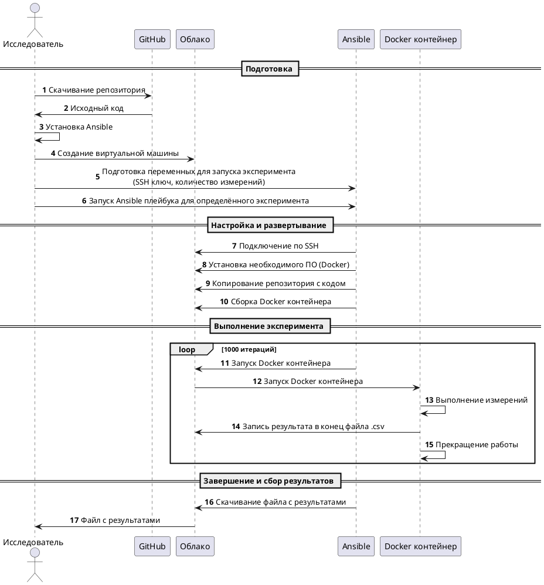

# Диаграмма проведения эксперимента

```plantuml
@startuml
autonumber
skinparam DefaultTextAlignment center

actor "Исследователь" as researcher
participant "GitHub" as github
participant "Облако" as cloud
participant "Ansible" as ansible
participant "Docker контейнер" as docker

== Подготовка ==

researcher -> github: Скачивание репозитория
github -> researcher: Исходный код
researcher -> researcher: Установка Ansible
researcher -> cloud: Создание виртуальной машины
researcher -> ansible: Подготовка переменных для запуска эксперимента\n(SSH ключ, количество измерений)
researcher -> ansible: Запуск Ansible плейбука для определённого эксперимента

== Настройка и развертывание ==

ansible -> cloud: Подключение по SSH
ansible -> cloud: Установка необходимого ПО (Docker)
ansible -> cloud: Копирование репозитория с кодом
ansible -> cloud: Сборка Docker контейнера

== Выполнение эксперимента ==

loop 1000 итераций
ansible -> cloud: Запуск Docker контейнера
cloud -> docker: Запуск Docker контейнера
docker -> docker: Выполнение измерений
docker -> cloud: Запись результата в конец файла .csv
docker -> docker: Прекращение работы
end

== Завершение и сбор результатов ==

ansible -> cloud: Скачивание файла с результатами
cloud -> researcher: Файл с результатами

@enduml
```
